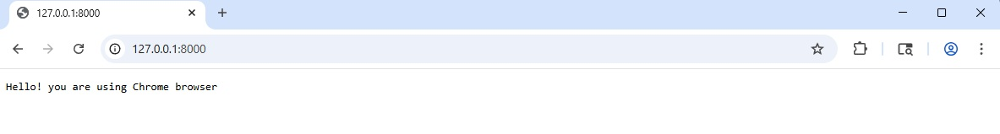
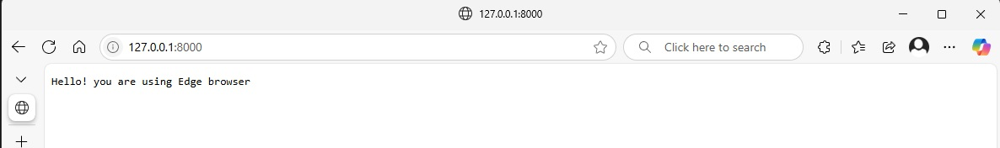

# Use Variants in Active Web apps

Variants provides a wrap variants_actix_web which has macro and context to leverage variants in Actix Web apps.

## Active web!

Let's write first Active Web application leveraging Variants! Start by creating a new binary-based
Cargo project and changing into the new directory:

```sh
cargo new actix-web-example --bin
cd actix-web-example
cargo add actix_web
cargo add variants_actix_web
```
**Note: todo pub the crate.**

Create a folder like bellow:
```
#:.
│   Cargo.toml
│
└───src
    │   main.rs
    │
    ├───app_state
    │   │   mod.rs
    │   │
    │   └───variants_processors
    │           browser.rs
    │           mod.rs
    │
    ├───configs
    │       index.toml
    │
    └───handlers
            index.rs
            mod.rs

```

We will add configuration file with content for diffent browser brand, an variants processor to detect browser brand, a context with configs and variants processors stored in app data as singleton, a handler to show the configed content based on browser brand from request context.

### configs: index.toml
```
# welcom message based on browser
welcome_msg&browser:edge = "Hello! you are using Edge browser"
welcome_msg&browser:chrome = "Hello! you are using Chrome browser"
welcome_msg = "Hello! you are not using Chromium-based browser"
```

### variants_processors: browser.rs
```
use actix_web::http::header::USER_AGENT;
pub(crate) struct Browservariants;

impl Default for Browservariants {
    fn default() -> Self {
        Self {}
    }
}

impl variants_actix_web::VariantsProcessor for Browservariants {
    fn process(
        &self,
        request: &actix_web::HttpRequest,
        variants: &mut variants_actix_web::default::DefaultVariants,
    ) {
        match request.headers().get("sec-ch-ua") {
            Some(sec_ch_ua_value) => {
                if let Ok(value_str) = sec_ch_ua_value.to_str() {
                    let lowwe_cased_value_str = value_str.to_lowercase();
                    if lowwe_cased_value_str.contains("microsoft edge") {
                        _ = variants.add("browser", "edge");
                    } else if lowwe_cased_value_str.contains("google chrome") {
                        _ = variants.add("browser", "chrome");
                    }
                }
            }
            _ => {
                if let Some(user_agent_value) = request.headers().get(USER_AGENT) {
                    if let Ok(value_str) = user_agent_value.to_str() {
                        let lowwe_cased_value_str = value_str.to_lowercase();
                        if lowwe_cased_value_str.contains("chrome/") {
                            match lowwe_cased_value_str.contains("edg/") {
                                true => {
                                    _ = variants.add("browser", "edge");
                                }
                                false => {
                                    _ = variants.add("browser", "chrome");
                                }
                            }
                        }
                    }
                }
            }
        }
    }
}
```

### handlers: index.rs
```
use actix_web::Responder;
use variants_actix_web::de::variants_config;
use variants_actix_web::serde::Deserialize;

#[derive(Debug, Deserialize)]
#[serde(crate = "variants_actix_web::serde")]
#[variants_config("index")]
pub(crate) struct IndexConfig {
    welcome_msg: String,
}

pub(crate) async fn index(index_config: IndexConfig) -> impl Responder {
    index_config.welcome_msg
}
```

### src: main.rs
```
mod app_state;
mod handlers;
use actix_web::{App, HttpServer, web};
use std::path::Path;

#[actix_web::main]
async fn main() -> std::io::Result<()> {
    HttpServer::new(|| {
        App::new()
            .app_data(web::Data::new({
                let mut variants_context =
                    variants_actix_web::variantsContext::new(&Path::new("src/configs")).unwrap();
                variants_context
                    .with_processor(app_state::variants_processors::Browservariants::default());
                variants_context
            }))
            .route("/", web::get().to(handlers::index))
    })
    .bind(("127.0.0.1", 8000))?
    .run()
    .await
}
```

### run the app
```
    Finished `dev` profile [unoptimized + debuginfo] target(s) in 0.51s
     Running `actix-web-example.exe`
```

### navigate to the url with Chrome and Edge.
* Chrome
>> 

* Edge
>> 

---
### [Next: Use Variants in Rocket apps](./Rocket.md)